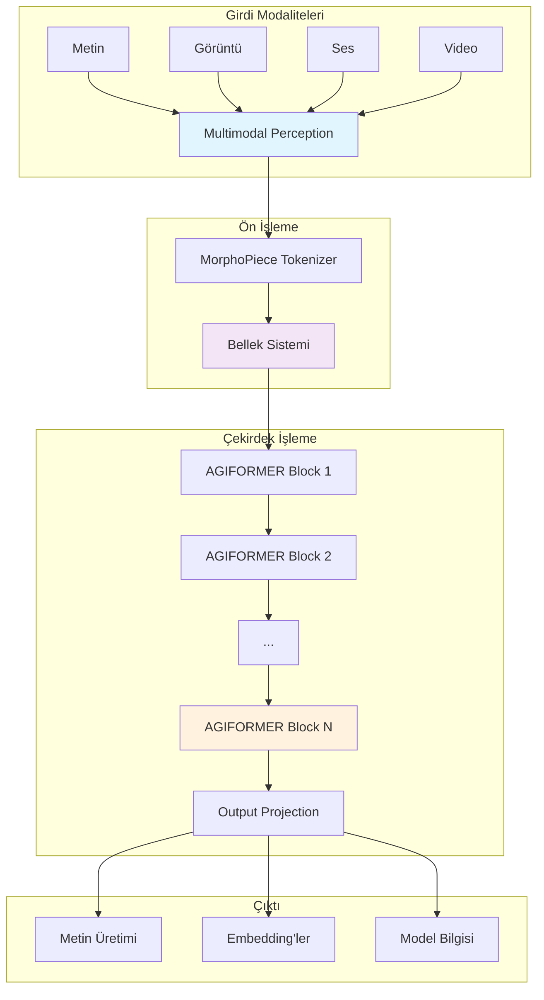
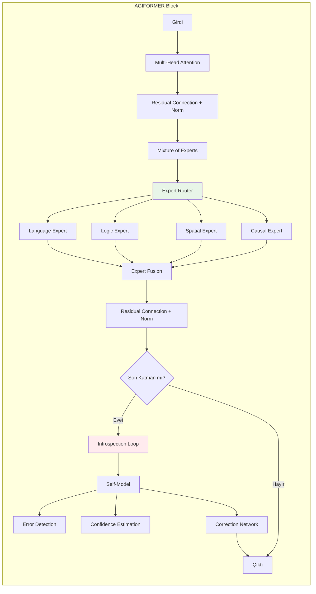
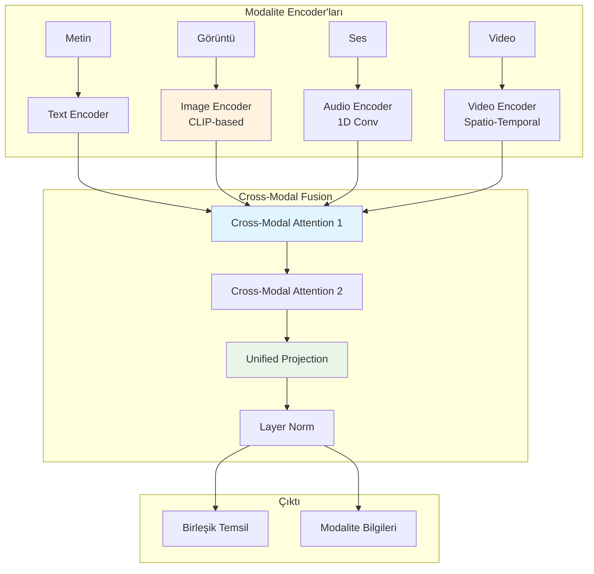
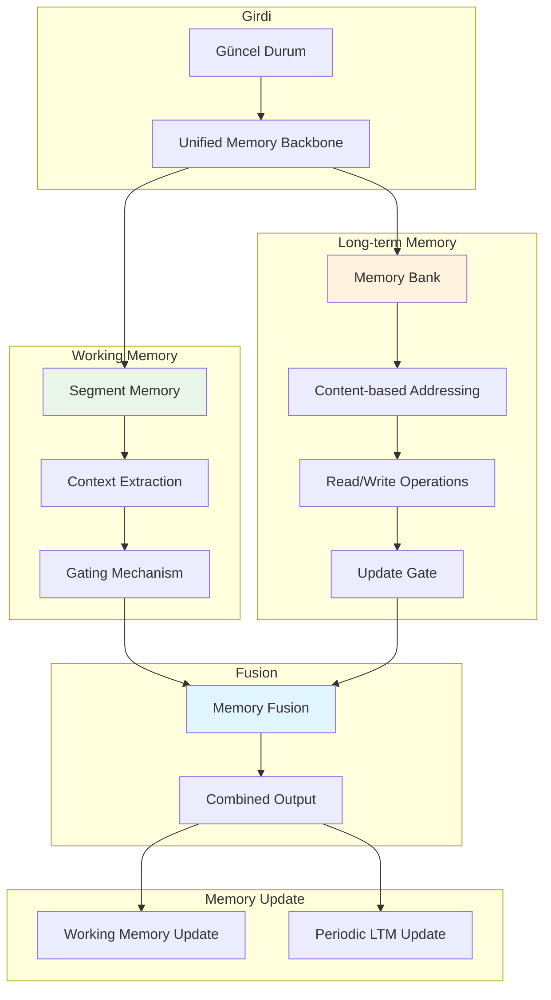
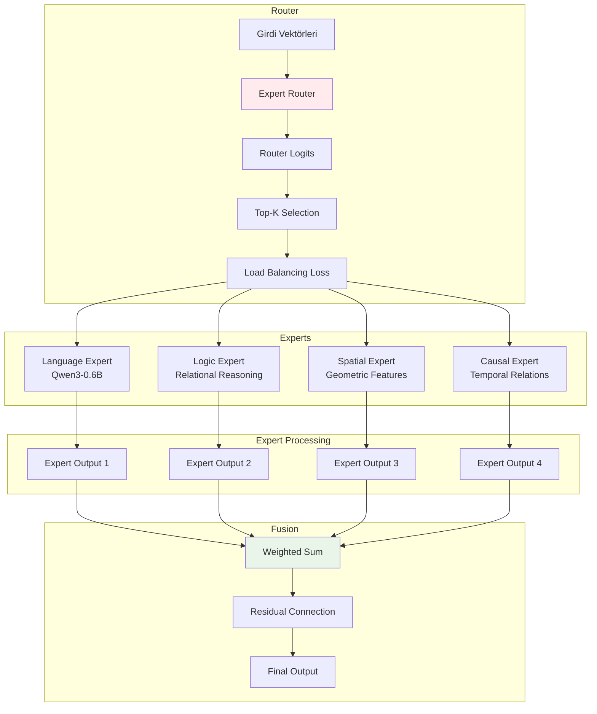
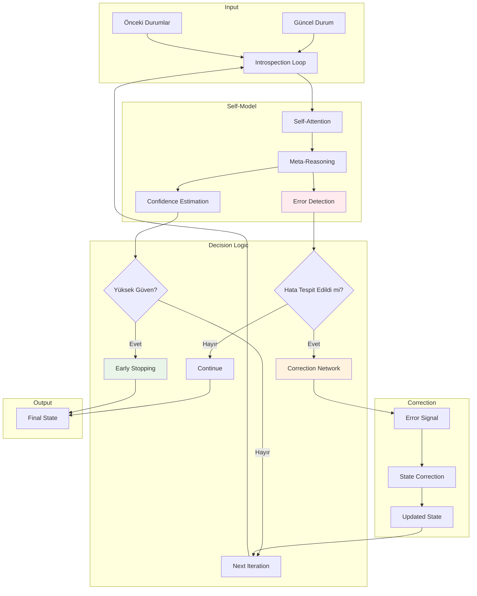
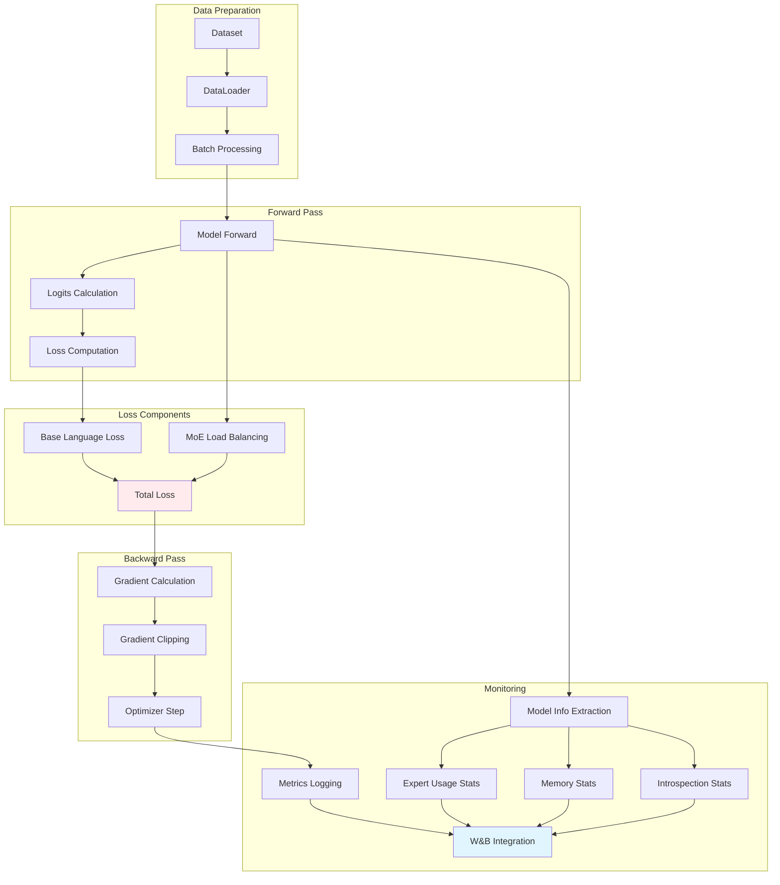
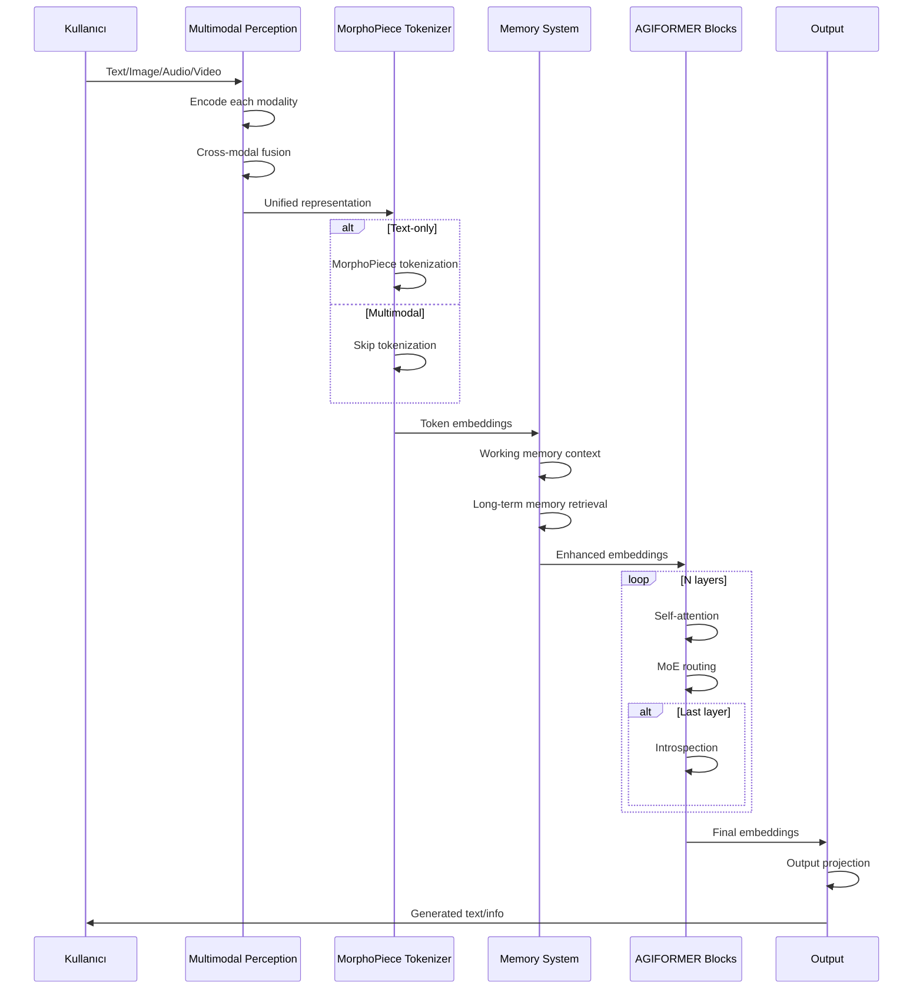
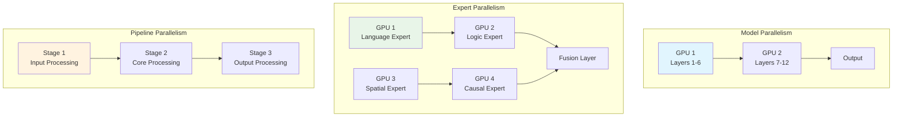

# AGIFORMER Mimari Diyagramları

## 1. Yüksek Seviye Mimari



## 2. AGIFORMER Blok Detayı



## 3. Multimodal Algı Sistemi



## 4. Bellek Sistemi Mimarisi



## 5. Uzman Karışımı (MoE) Sistemi



## 6. İç Gözlem Sistemi



## 7. Eğitim Akışı



## 8. Veri Akışı Detayı



## 9. Model Paralelizasyon



## 10. Optimizasyon Stratejileri

```mermaid
graph TB
    subgraph "Memory Optimization"
        A[Mixed Precision] --> B[FP16 Training]
        C[Gradient Checkpointing] --> D[Reduced Memory]
        E[Sequence Packing] --> F[Better Utilization]
    end
    
    subgraph "Compute Optimization"
        G[Flash Attention] --> H[Faster Attention]
        I[Expert Caching] --> J[Reduced Computation]
        K[Linear Attention] --> L[O(n) Complexity]
    end
    
    subgraph "Training Optimization"
        M[Learning Rate Scheduling] --> N[Better Convergence]
        O[Load Balancing] --> P[Expert Utilization]
        Q[Gradient Accumulation] --> R[Larger Effective Batch]
    end
    
    style B fill:#e8f5e8
    style H fill:#e8f5e8
    style N fill:#e8f5e8
